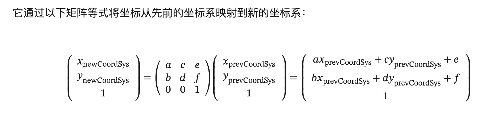
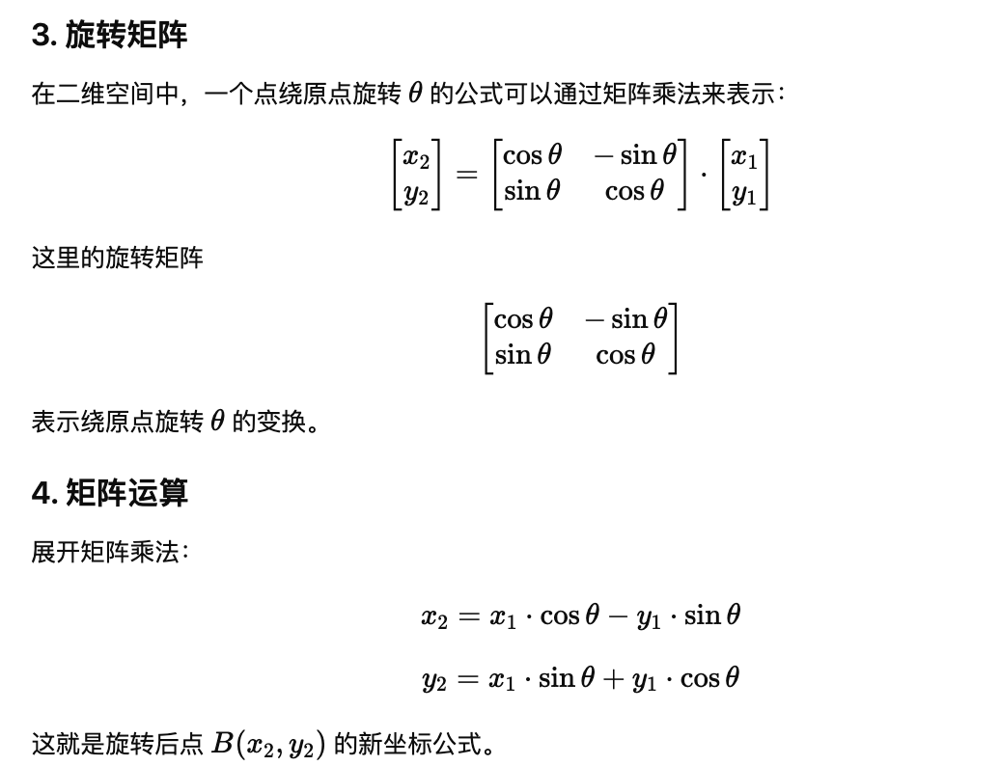
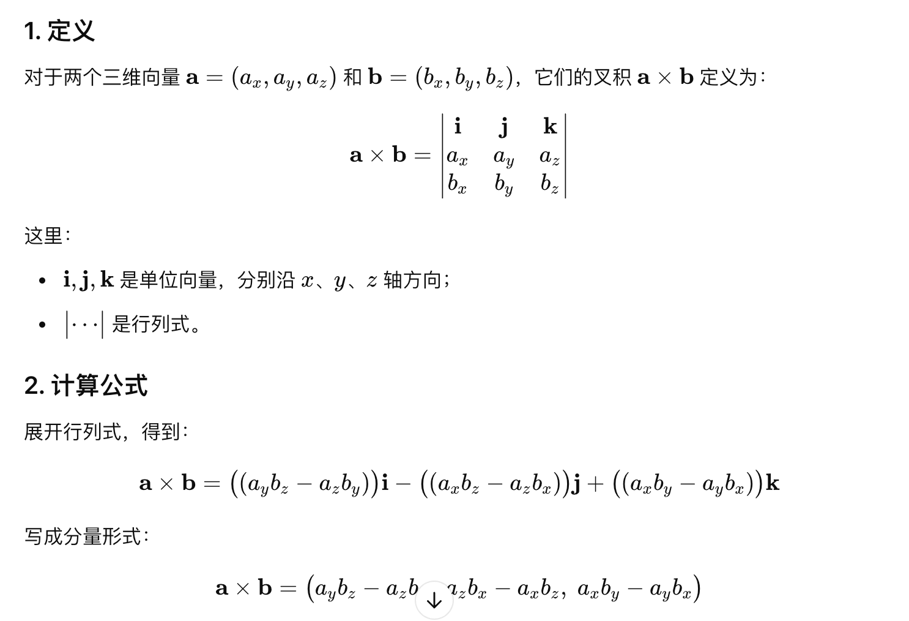

# mini-fabric-whiteboard

使用fabric实现画板功能，支持画笔，绘制直线，矩形，圆形，文字，移动缩放画布，撤销重做，插入图片，清屏与保存功能

# 访问链接

https://enson0131.github.io/mini-fabric-whiteboard/

# 启动

```shell
yarn
yarn dev
```

# 功能
- 通过 option + 鼠标 拖动画布
- 滚动鼠标滚轮缩放画布

# 坑点
1. fabric 默认没有支持擦出功能，可以在 npm 包里面的 mixin 获取对应的擦出功能包


# 参考
1. fabric.js文档：http://fabricjs.com/docs/
2. https://github.com/CC4J/fabric-drawing-board-plugin-demo
3. https://github1s.com/CC4J/fabric-drawing-board/tree/master
4. https://juejin.cn/post/6979135887485435918?searchId=20241127103227E0EBB2688A4372FD09E4
5. https://juejin.cn/post/6993801903121367048?searchId=20241127103227E0EBB2688A4372FD09E4
6. https://fabricjs.com/demos/free-drawing/
7. https://www.imgeek.net/article/825363377
8. https://gitee.com/dhb_bo/fabricjs-demo
9. https://antv.vision/infinite-canvas-tutorial/zh/guide/lesson-006
10. https://medium.com/@sagarmohanty2k00/creating-a-digital-whiteboard-element-with-react-js-d4924ee2c58e
11. https://github.com/thfrei/infinite-drawing-canvas
12. https://keelii.com/2021/05/09/fabricjs-internals

## 如何实现全局漫游

通过 viewportTransform 做平移、缩放就好了
通过 tramsform api 做矩阵变化，参数 是一个数组，里面有6个元素，默认值是 [1, 0, 0, 1, 0, 0]。

```
[0]: 水平缩放（x轴方向）
[1]: 水平倾斜（x轴方向）
[2]: 垂直倾斜（y轴方向）
[3]: 垂直缩放（y轴方向）
[4]: 水平移动（x轴方向）
[5]: 垂直移动（y轴方向
```

- https://juejin.cn/post/7142664492122374158?from=search-suggest

## 如何实现缩放画布

1 先修改 viewportTransform[0]、viewportTransform[3] 达到缩放横纵坐标的值
2 通过修改 viewportTransform[4]、viewportTransform[5] 达到平移画布的效果，确保缩放的中心点不变
3 然后重新渲染画布就好了

- https://developer.mozilla.org/zh-CN/docs/Web/SVG/Attribute/transform#matrix




## 如何实现插入图片
通过 imageSmoothingEnabled 设置为 true 加了这个属性，用于对缩放后的图片进行平滑处理
再通过 drawImage 绘制图片

## 如何实现插入文本
双击创建一个 input 输入框，失去焦点后获取 input 的值，然后将文本添加到画布上

## 如何实现擦除功能
1 通过设置 globalCompositeOperation 为 destination-out 实现擦除功能
2 使用 clip - https://developer.mozilla.org/zh-CN/docs/Web/API/CanvasRenderingContext2D/clip，目前 fabric.js 使用的是这个方式

### 如何实现元素 hover 状态

在 Fabric 中, 在激活某个元素时，通常会有一个边框显示在元素周围，这个就是包围盒。

常见的有 OBB、AABB、球模型 包围盒。

其中 AABB 最为简单，应用也最为广泛，它的全称是 Axis-aligned bounding box，也就是边平行于坐标轴的包围盒，理解和计算起来都非常容易，就是取物体所有顶点（也可叫做离散点）坐标的最大最小值，就像下面这样

获取鼠标的坐标，判断某个点是否在多边形内，可以使用 `点射法` 实现

判断点是否在多边形内的其他方法:

- 用 canvas 自身的 api isPointInPath
- 将多边形切割成多个三角形，然后判断点是否在某个三角形内部
- 转角累加法
- 面积法

### 如何实现元素 点选

和 hover 状态判断一致，只是在点击的时候，判断是否在元素内部，如果在元素内部，就选中元素，然后设置元素的状态为 active，在重新渲染的时候，就会将元素的包围盒显示出来

这里点选会进行一些优化，比如记录最近一个激活的物体，然后点选的时候先判断鼠标点是否在最近一个激活物体的内部，如果在，就可以省去遍历的过程了。


这里会有一个问题，如果是通过包围盒判断的话，有可能点击区域是一个空白区域，fabric 中会有一个缓冲 Canvas 层

1. 通过包围盒判断出来的元素，会在缓冲 Canvas 层绘制出图像
2. 会取鼠标点周围的一小块正方形的像素信息，接着遍历每个像素，如果找到一个像素中 rgba 的 a 的值 > 0 就说明至少有一个颜色存在，亦即不透明，退出循环，否则就是透明的，最后清除 getImageData 变量，清除缓冲层画布即可。

## 如何实现元素的框选

判断俩个矩形是否相交

判断俩个矩形是否相交，可以通过判断矩形的四个顶点是否在另一个矩形内部，如果有一个点在另一个矩形内部，那么就说明这俩个矩形相交 （需要考虑包含关系）
或者判断矩形的四个边是否相交，如果有一个边相交，那么就说明这俩个矩形相交 （需要考虑包含关系）

不过在 计算机图形学中，通过 `向量叉乘` 的方式来判断线段是否相交


## 任意点 （x, y）绕某个点 （rx0, ry0）逆时针旋转 a 角度后的坐标为 `(x0, y0)`，公式如下：


x0 = (x - rx0) * cos(a) - (y - ry0) * sin(a) + rx0
y0 = (x - rx0) * sin(a) + (y - ry0) * cos(a) + ry0



公式推导: https://jingyan.baidu.com/article/2c8c281dfbf3dd0009252a7b.html

## 倾斜矩阵公式 （以倾斜了 40度角为例）

水平倾斜（SkewX）：[ 1,  0,  0, tan(θx),  1,  0, 0,  0,  1 ]

其中 θx 是倾斜角的水平分量。
水平倾斜会改变 x 方向的坐标值，使得变换后的 x 坐标依赖于 y 坐标。


竖直倾斜（SkewY）：[ 1,  tan(θy),  0,  1,  0,  0, 0,  0,  1 ]
其中 θy 是倾斜角的竖直分量。
竖直倾斜会改变 y 方向的坐标值，使得变换后的 y 坐标依赖于 x 坐标。

如果倾斜 40°，对应的矩阵
假设倾斜角 θ = 40°，将角度转换为弧度（1° = π/180 弧度）： θ (radians) = 40 * π / 180 ≈ 0.6981
1. 水平倾斜矩阵 (SkewX):
计算 tan(40°)：
tan(40°) ≈ 0.8391

[ 1,  0,  0.8391, 1, 0, 0, 0, 0, 1 ]

2. 竖直倾斜矩阵 (SkewY):
tan(40°) ≈ 0.8391

[ 1,  0.8391,  0,  1,  0,  0, 0,  0,  1 ]

在做矩阵乘法的时候，需要将矩阵的每一行与另一个矩阵的每一列相乘，然后将结果相加，得到新的矩阵
矩阵乘法: C = A × B
```
C[i][j] = Σ A[i][k] × B[k][j] // 矩阵乘法公式


// a 矩阵
a[0] a[2] a[4]    // 第一行：a, c, e
a[1] a[3] a[5]    // 第二行：b, d, f
0     0     1     // 第三行：恒定值

// b 矩阵
b[0] b[2] b[4]
b[1] b[3] b[5]
0     0     1

// 结果矩阵
[
   a[0] * b[0] + a[2] * b[1],
   a[1] * b[0] + a[3] * b[1],
   a[0] * b[2] + a[2] * b[3],
   a[1] * b[2] + a[3] * b[3],
   is2x2 ? 0 : a[0] * b[4] + a[2] * b[5] + a[4],
   is2x2 ? 0 : a[1] * b[4] + a[3] * b[5] + a[5],
]
```


## 判断 三个点 是否在同一个直线上

可以通过向量叉乘的方式，三个点 A(x1, y1, z1), B(x2, y2, z2), C(x3, y3, z3) 是否在同一直线上。

例如 AB x AC，如果等于 0 向量，那么三个点在同一直线上



例如输入：points = `[[1,1],[2,3],[3,2]]`

```TypeScript
function isBoomerang(ps: number[][]): boolean {
    return (ps[1][0] - ps[0][0]) * (ps[2][1] - ps[0][1]) !== (ps[2][0] - ps[0][0]) * (ps[1][1] - ps[0][1]);
};

console.log(isBoomerang([[1,1],[2,3],[3,2]])); // true  三个点在同一直线上
```

## 如何实现编辑功能

## 如何实现撤销重做功能


## 书写性能优化

- https://juejin.cn/post/6844903834179878925#heading-2


## 计算机图形学
- https://www.bilibili.com/video/BV1X7411F744/


## 好文
- https://github.com/lgq627628/2020
- https://www.yuque.com/r/antv/books?q=